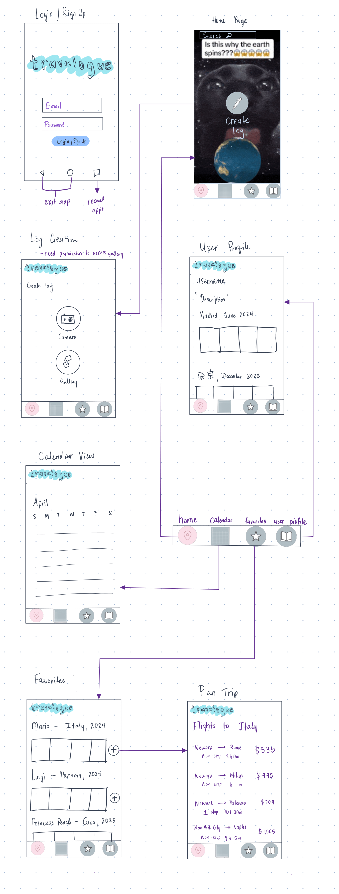
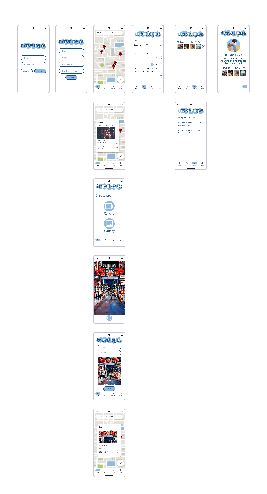

# Milestone 1 - Travelogue (Unit 7)

## Table of Contents

1. [Overview](#Overview)
1. [Product Spec](#Product-Spec)
1. [Wireframes](#Wireframes)

## Overview

### Description

This app is essentially a travel diary for users to reflect on their travels and view others’. For anyone who travels, being able to have a personal time capsule of the places they have visited is an invaluable way to preserve memory. For the avid traveler, this is a great way to document their experiences via an online journal and seamlessly organize photos using location and time. Users can feel inspired by other travelogues (user posts on the app), and plan a similar getaway to quench their FOMO.  

### App Evaluation

- **Category:** Travel, Lifestyle, Photo and Video

- **Mobile:** Users would be able to use their device’s camera to take photos and upload them. The app would have push notifications of new or popular activities to discover nearby, using their location, and also posts similar to what the user has interacted with. 

- **Story** This app is essentially a travel diary for users to reflect on their travels. For anyone who travels, being able to have a personal time capsule of the places they have visited is an invaluable way to preserve memory. For the avid traveler, this is a great way to document their experiences and seamlessly organize photos using location and time. I think my friends would love the idea of seeing where other friends have traveled, they are able to get reliable recommendations and eventually share their unique experiences by planning through the app. 

- **Market:** This app is directed to anyone who travels, therefore everyone. Whether a user travels within their state, country or internationally, they can utilize this app to log their journey. There are a lot of travel apps available, but none have integrated budgeting, media and geolocation. 

- **Habit:** We live in the age of social media where people want to showcase their lives and experiences and also consume media from people of interest. To increase addictiveness and potential habit formation, the introduction of a travel stamp (like in a passport) is introduced. Travel stamps are awarded when the user has visited certain locations or hit certain milestones. Having a good UX and UI design will also encourage users to frequent the app. Users may open the app more frequently to view other travelogues and get ideas for their next visit than they do to create posts.

- **Scope:** A stripped down version of the app is still very appealing to build and that is what we hope to achieve by the end of the program. Focusing on the core functionality, we want to implement geolocation services, user authentication and multimedia integration while using travel booking APIs like Duffel API Quick Start Collection | Duffel | Postman API Network for flights and BookingAPI | Get Started | Postman API Network for hotels. 

## Product Spec

### 1. User Features (Required and Optional)

**Required Features**

1. Multimedia integration
2. Geolocation
3. User profile
4. Travel planning (flights only)
5. Location based organization

**Optional Features**

1. Wallet page where you store all your travel information in one place
2. Personalization (light/dark mode)
3. Calendar view for upcoming trips 

### 2. Screen Archetypes

- Log In / Sign up
  - User can log into their account
  - User can sign up for a new account

- Map View / Home Screen 
  - User can view a map centered to their location with “pins” containing logs from other people

- Calendar View 
  - https://developers.google.com/calendar/v3/reference/
  - User can view upcoming trips from a calendar view

- User Profile 
  - A collection of the user’s travelogues. Sorted chronologically, and grouped by location. 

- Log Creation
  - User can take a photo and add a caption

- Flight Suggestions
  - User can view a flights page to a favorited location with flight details (price and location)

### 3. Navigation

**Tab Navigation** (Tab to Screen)

* Home
* Calendar
* Favorites 
* User Profile

**Flow Navigation** (Screen to Screen)

- Login
  - => Map Screen / Home

- Registration
  - => Map Screen / Home

- Favorites
  - => Flight summary
    
- Map Screen
  - => Log Creation

- Calendar
  - => None, potentially have links to external websites if needed

- Log Creation
  - => Map Screen after posting

- User Profile
  - => None

## Wireframes

 

 

### [BONUS] Digital Wireframes & Mockups

### [BONUS] Interactive Prototype

GIF created with [ScreenToGif](https://www.screentogif.com/) for Windows
 

# Milestone 2 - Build Sprint 1 (Unit 8)

## GitHub Project board

## Issue cards

## Issues worked on this sprint

- User can access login and signup pages, which redirect to home page when pressing login/create account
- Working map screen with button to navigate to screen to create log
- Create log page has two button options to take a photo or choose from a gallery
- Profile tab with user information
- Favorites tab to store favorite logs

GIF created with [ScreenToGif](https://www.screentogif.com/) for Windows

 

# Milestone 3 - Build Sprint 2 (Unit 9)

## GitHub Project board

## Completed user stories

- User can create a new account
- User can log into a pre-existing account
- User can add photo from gallery to log
- User can view log from map with associated location

List any pending user stories / any user stories you decided to cut
from the original requirements
- User can view favorited logs
- User can look at flights from the location of favorited logs
- User can customize profile and show logs on their profile
- User can have in-app calendar to add travel events

## App Demo Video

- [https://youtu.be/lOTnMbm62dI](https://youtu.be/lOTnMbm62dI) 
